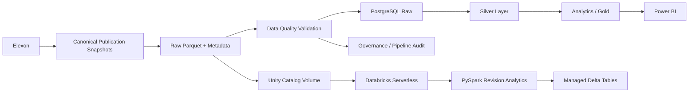

# GB Generation Availability Intelligence Platform

End-to-end Great Britain electricity generation availability data engineering and analytics platform built with **Elexon data, Python, PostgreSQL, PySpark, Databricks Serverless, Unity Catalog, Delta Lake and Power BI-ready analytical models**.

## Overview

Generation availability data changes as market participants revise their expected operating positions. Looking only at the latest publication loses that historical information.

This platform preserves successive Elexon publication snapshots and transforms them into analytical datasets showing how expected GB generation availability changes at generating-unit, fuel and whole-system level.

The project demonstrates a production-style workflow spanning **data ingestion, validation, transformation, SQL modelling, distributed processing, cloud execution, governance, testing and analytics**.

## Architecture



## Core Analytical Outputs

| Dataset | Purpose |
|---|---|
| `fuel_availability_history` | Historical available generation capacity by fuel type |
| `system_availability_history` | Whole-system GB generation availability history |
| `unit_revision_history` | Publication-to-publication revisions by generating unit |
| `fuel_revision_history` | Revision movements aggregated by fuel |
| `system_revision_history` | Whole-system publication revision history |

## Verified Databricks Deployment

The PySpark pipeline has been successfully executed using **Databricks Serverless compute** from GitHub-hosted source code.

| Metric | Result |
|---|---:|
| Raw records processed | **28,600** |
| Canonical publications | **4** |
| Duplicate source keys | **0** |
| Automated tests | **49 passed** |
| Databricks job status | **SUCCESS** |

### Unity Catalog Managed Delta Tables

| Table | Rows |
|---|---:|
| `workspace.gb_generation.fuel_availability_history` | **988** |
| `workspace.gb_generation.system_availability_history` | **52** |
| `workspace.gb_generation.unit_revision_history` | **21,450** |
| `workspace.gb_generation.fuel_revision_history` | **741** |
| `workspace.gb_generation.system_revision_history` | **39** |

Raw cloud data is stored in the Unity Catalog volume:

`workspace.gb_generation.raw_uou2t14d`

## Data Engineering Workflow

1. **Ingestion** - collect and preserve Elexon generation availability publication snapshots.
2. **Data Quality** - validate publication history, schema integrity, row counts and duplicate source keys.
3. **Transformation** - create structured unit, fuel and system availability histories.
4. **Revision Intelligence** - compare successive publications to quantify changes in expected availability.
5. **PostgreSQL Modelling** - organise data into Raw, Silver, Analytics/Gold and Governance layers.
6. **PySpark Processing** - build scalable analytical datasets from canonical Parquet history.
7. **Databricks Serverless** - execute the Spark workflow from GitHub-hosted source code.
8. **Unity Catalog & Delta Lake** - govern raw data and persist managed analytical tables.
9. **Analytics Consumption** - expose Power BI-ready datasets and KPIs.

## Testing and Reliability

Automated tests cover transformation logic, data quality, Spark processing, persistence behaviour, idempotent execution, Databricks job wrappers and configuration behaviour.

Verified test result: **49 passed**.

The analytical workflow is designed to be deterministic when rerun against the same canonical publication history.

## Technology Stack

**Data Engineering:** Python, pandas, PySpark, Apache Spark, PostgreSQL, SQL, Parquet, Delta Lake

**Cloud & Governance:** Databricks Serverless, Unity Catalog, Unity Catalog Volumes, Managed Delta Tables, Databricks Jobs

**Analytics:** Power BI, SQL analytical views, generation availability KPIs, revision intelligence

**Engineering:** Git, GitHub, pytest, modular pipelines, environment-based configuration, automated validation

## Repository Structure

```text
config/        Project configuration
databricks/    Databricks job entry points
src/           Ingestion, analytics and pipeline modules
tests/         Automated test suite
databricks.yml Databricks deployment configuration
README.md      Project documentation
```

## Capabilities Demonstrated

- End-to-end data pipeline design
- Electricity-market data integration
- ETL/ELT workflow development
- Layered PostgreSQL analytical modelling
- Historical revision data engineering
- Scalable PySpark transformations
- Parquet and Delta Lake persistence
- Databricks Serverless deployment
- Unity Catalog governance
- Managed analytical table creation
- Automated data-quality validation
- Automated testing
- Power BI-ready analytical modelling
- Git-based cloud deployment workflows

## Energy-System Value

Historical availability revisions can support analysis of changing generator expectations, plant availability uncertainty, fuel-specific capacity movements, system-level availability changes, operational risk, market tightness and forecast revision behaviour.

The project combines **electricity-market domain knowledge with modern data engineering**, converting raw market publications into governed and decision-ready analytical data products.

## Status

**End-to-end engineering pipeline operational and validated.**

The successful Databricks deployment processed **28,600 records across four canonical publications with zero duplicate source keys**, and generated all five expected managed Delta analytical tables.
