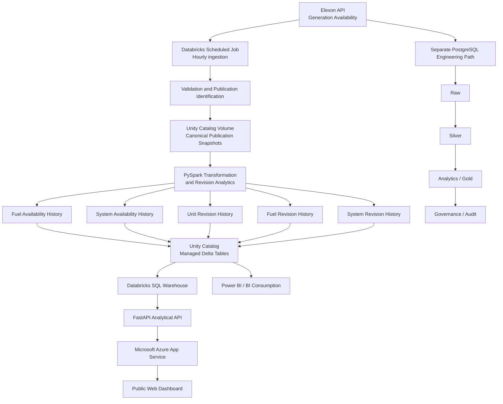

# GB Generation Availability Intelligence Platform

> A production-style Great Britain electricity generation availability intelligence platform that preserves successive Elexon publications, tracks changes in expected generation availability, derives revision and forecast-stability intelligence, and serves live analytical outputs through Databricks, Unity Catalog, FastAPI and Microsoft Azure.
>


[](https://github.com/kamilkenny/GB-generation-availability-intelligence-platform/tree/v1.0.0)
[](https://www.python.org/)
[](https://spark.apache.org/)
[](https://www.databricks.com/)
[](https://azure.microsoft.com/)
[](https://fastapi.tiangolo.com/)
[](LICENSE)

---

## Live Application

### Public dashboard

**GB Generation Availability Intelligence**

https://gb-generation-intelligence-kamil.azurewebsites.net/

The public application is hosted on **Microsoft Azure App Service** and retrieves governed analytical data from a **Databricks SQL Warehouse** using a dedicated Databricks service principal and OAuth machine-to-machine authentication.

---
> # Developed by Kamil Ridwan
>
> 
# Overview

Generation availability is not static.

Electricity generators continually revise their expected operating positions as outages, maintenance schedules, technical conditions and operational expectations change.

A dashboard that shows only the latest publication can answer:

> **What generation capacity is currently expected to be available?**

But it cannot fully answer:

- What changed between publications?
- Which generating units caused the change?
- Which fuel categories are experiencing the greatest revision activity?
- Is the overall availability outlook strengthening or weakening?
- How frequently are published availability expectations changing?
- Is the latest forecast relatively stable or experiencing elevated revision activity?

This project was developed to address that broader analytical problem.

The platform preserves successive **Elexon generation availability publications** and converts them into governed historical datasets that support:

- whole-system availability analysis;
- fuel-level availability analysis;
- unit-level revision tracking;
- fuel-level revision intelligence;
- system-level revision analysis;
- historical publication comparison;
- forecast stability analysis;
- early-warning indicators;
- Power BI-ready consumption;
- public web visualisation.

The result is not simply a generation dashboard.

It is an **end-to-end generation availability intelligence platform**.

---

# Key Innovation

## Availability Stability & Early Warning Intelligence

A distinguishing feature of the platform is its custom **Availability Stability & Early Warning** analytical layer.

Most availability reporting focuses on the latest expected position.

This platform additionally asks:

> **How stable has that expectation been across successive publications?**

The platform derives a transparent **Historical Stability Score** from publication-to-publication revision behaviour.

The current implementation defines the score as:

```text
Historical Stability Score
=
Unchanged historical unit revision records
-------------------------------------------
Total historical unit revision records
× 100
```

For example:

```text
Historical Stability Score
96.7 / 100

Classification
Highly stable
```

A high score indicates that a large proportion of recorded unit availability expectations remained unchanged between successive comparable publications.

A lower score indicates greater publication-to-publication revision activity.

The platform also derives an **Availability Watch** from recent net revision movement.

Example:

```text
24h Net Revision Movement
+10,025 MW

Availability Watch
UPWARD BIAS

Most Revised Fuel
Wind
```

This shifts the analytical question from:

> **How much generation is available?**

towards:

> **How stable is that expectation, and in which direction is the availability outlook changing?**

### Important interpretation

The Stability Score and Availability Watch are **custom analytical decision-support indicators**.

They are not official Elexon or NESO:

- adequacy measures;
- reliability measures;
- reserve-margin measures;
- Loss of Load Probability measures;
- operational control-room signals.

They are specifically designed to quantify and communicate **publication revision behaviour**.

---

# Architecture



---

# Production Data Flow

The live cloud path operates automatically:

```text
Every hour
    ↓
Elexon API
    ↓
Databricks scheduled job
    ↓
Validation
    ↓
Publication identification
    ↓
Canonical publication snapshot
    ↓
Unity Catalog Volume
    ↓
PySpark availability and revision analytics
    ↓
Five managed Delta tables
    ↓
Databricks SQL Warehouse
    ↓
FastAPI
    ↓
Azure App Service
    ↓
Public dashboard
```

The architecture deliberately separates:

- ingestion;
- validation;
- storage;
- transformation;
- analytical modelling;
- serving;
- presentation.

---

# Separate PostgreSQL Engineering Path

The repository also contains a PostgreSQL implementation used to demonstrate relational data engineering and layered ETL/ELT design.

```text
Elexon
   ↓
PostgreSQL Raw
   ↓
Silver
   ↓
Analytics / Gold
   ↓
Governance / Audit
```

The PostgreSQL implementation is intentionally maintained as a separate engineering path rather than being replaced by Azure infrastructure.

It demonstrates:

- relational schema design;
- staged transformation;
- analytical SQL modelling;
- pipeline auditing;
- idempotent loading;
- governance metadata;
- reproducible ETL/ELT processing.

---

# Data Source

The primary source is **Elexon generation availability data** associated with UOU2T14D reporting.

Successive publications are retained rather than overwriting earlier observations.

That design decision is fundamental to the project.

Without publication history, the platform could show the latest state but could not reconstruct how expectations changed.

---

# Analytical Data Model

The Databricks implementation persists five principal analytical datasets.

| Dataset | Purpose |
|---|---|
| `fuel_availability_history` | Available generation capacity by fuel type across publications and forecast dates |
| `system_availability_history` | Whole-system GB generation availability |
| `unit_revision_history` | Publication-to-publication availability revisions by individual generating unit |
| `fuel_revision_history` | Availability revision movements aggregated by fuel category |
| `system_revision_history` | Whole-system publication revision history |

These datasets are persisted as managed Delta tables under:

```text
workspace.gb_generation
```

### Managed Delta tables

```text
workspace.gb_generation.fuel_availability_history
workspace.gb_generation.system_availability_history
workspace.gb_generation.unit_revision_history
workspace.gb_generation.fuel_revision_history
workspace.gb_generation.system_revision_history
```

Canonical raw cloud publication snapshots are retained in the Unity Catalog volume:

```text
workspace.gb_generation.raw_uou2t14d
```

---

# Analytical Capabilities

## 1. Whole-System Availability

The platform identifies the latest publication and calculates the forward GB generation availability profile.

This allows users to examine expected available capacity across upcoming forecast dates rather than viewing only a single point in time.

---

## 2. Fuel Availability

Available MW is aggregated by generation or interconnector category.

Examples include:

- Combined Cycle Gas Turbine;
- Open Cycle Gas Turbine;
- Nuclear;
- Wind;
- Biomass;
- Pumped Storage Hydro;
- Non-Pumped Storage Hydro;
- interconnectors.

The dashboard provides both:

- ranked available MW by category;
- percentage contribution to the represented capacity mix.

---

## 3. Available Capacity Mix

The capacity-mix visual converts available MW into proportional shares.

This gives a rapid indication of the generation categories contributing the largest proportion of the currently represented availability.

### Dataset coverage note

The source does not represent all embedded generation equally.

Distributed generation, particularly some solar PV connected to distribution networks, may not appear as individually visible Balancing Mechanism generating units.

Its contribution can therefore be underrepresented in unit-level availability views and may instead appear indirectly through lower system demand.

---

# Revision Intelligence

The platform compares successive publications to determine how expected generation availability changes.

A revision is conceptually calculated as:

```text
Revision MW
=
Current Publication Available MW
-
Previous Comparable Publication Available MW
```

This converts a sequence of forecasts into a historical record of forecast evolution.

---

## Unit-Level Revision Intelligence

For each generating unit the platform records:

- generating unit;
- fuel type;
- direction;
- revision MW;
- forecast date;
- publication time.

Example:

```text
+370 MW
```

means expected availability increased by 370 MW relative to the previous comparable publication.

Example:

```text
-308 MW
```

means expected availability decreased by 308 MW.

---

## Fuel-Level Revision Intelligence

Unit revisions are aggregated by fuel category to identify which generation technologies are driving changes in expected availability.

Positive revision:

```text
Net Revision MW > 0
```

indicates upward availability revision activity.

Negative revision:

```text
Net Revision MW < 0
```

indicates downward availability revision activity.

The dashboard uses semantic colour encoding:

```text
Green = upward availability revision
Red   = downward availability revision
```

---

## Revision Direction Distribution

Historical revision records are classified as:

```text
Upward
Downward
Unchanged
```

The resulting distribution provides a compact view of forecast revision behaviour and is also used in the current Stability Score.

---

## Revision Signals

The platform automatically identifies several market-intelligence signals.

### Largest upward revision

The largest positive individual generating-unit revision during the latest analytical window.

### Largest downward revision

The largest negative individual generating-unit revision.

### Most revised fuel

The fuel category with the greatest total **absolute** MW revision activity.

Absolute revision activity is used because positive and negative movements would otherwise partially cancel one another.

Conceptually:

```text
Absolute Revision Activity
=
Σ |Revision MW|
```

---

# Availability Stability & Early Warning

The Stability & Early Warning section converts revision history into concise stakeholder-facing intelligence.

It currently provides four principal indicators.

---

## Historical Stability Score

The percentage of historical unit revision records that recorded no change in MW between comparable publications.

```text
Stability Score
=
Unchanged Revision Records
--------------------------
Total Revision Records
× 100
```

The current dashboard expresses the result on a 0–100 scale.

### Current classification logic

```text
95–100      Highly stable
90–94.99    Stable
80–89.99    Moderately stable
Below 80    High revision activity
```

This is a measure of **publication stability**, not a probability that generation will physically be delivered.

---

## 24-Hour Net Revision Movement

The platform aggregates fuel-level revision movement across the latest 24-hour analytical window.

Conceptually:

```text
24h Net Revision Movement
=
Σ Fuel Net Revision MW
```

Positive values indicate an overall upward revision bias.

Negative values indicate an overall downward revision bias.

---

## Availability Watch

The latest net revision position is translated into a concise signal:

```text
Net revision > 0
→ UPWARD BIAS

Net revision < 0
→ DOWNWARD WATCH

Net revision = 0
→ BALANCED
```

This gives a stakeholder an immediate view of current publication direction without manually inspecting thousands of unit-level revision records.

---

## Most Revised Fuel

The generation category with the highest total absolute MW revision activity is surfaced as an additional signal.

This helps identify which technology is currently responsible for the greatest amount of forecast adjustment.

---

# Public Web Dashboard

The production presentation layer is implemented using:

```text
FastAPI
Jinja2
JavaScript
Chart.js
HTML
CSS
Gunicorn
Uvicorn
```

The application is hosted on:

```text
Microsoft Azure App Service
Region: Germany West Central
```

The public browser never connects directly to Databricks.

---

# API Layer

FastAPI exposes analytical endpoints used by the public dashboard.

| Endpoint | Purpose |
|---|---|
| `/health` | Application health check |
| `/api/kpis` | Executive platform KPIs |
| `/api/system-availability` | Forward GB system availability |
| `/api/fuel-availability` | Latest available capacity by fuel |
| `/api/fuel-revisions` | Recent fuel-level revision intelligence |
| `/api/revision-directions` | Historical revision direction counts |
| `/api/revision-signals` | Largest upward/downward revision and most-revised-fuel signals |
| `/api/top-unit-revisions` | Largest recent generating-unit revisions |
| `/api/stability-intelligence` | Custom Stability & Early Warning indicators |

The serving pattern is:

```text
Browser
   ↓
FastAPI
   ↓
Databricks SQL Warehouse
   ↓
Unity Catalog Delta Tables
```

---

# Secure Production Authentication

Local development and production use different authentication mechanisms.

## Local development

Local development supports authentication through a Databricks CLI profile using a scoped personal access token.

## Azure production

Production uses a dedicated Databricks service principal:

```text
Azure App Service
       ↓
OAuth 2.0 M2M
       ↓
Databricks Service Principal
       ↓
Databricks SQL Warehouse
```

Credentials are supplied to Azure App Service through secure application settings.

No Databricks OAuth secret is:

- embedded in JavaScript;
- exposed to the browser;
- hard-coded in application source;
- committed to GitHub.

The production identity follows least-privilege principles and is restricted to the resources required by the web application.

Its permissions include:

- Databricks SQL access;
- `CAN USE` on the required SQL warehouse;
- `USE CATALOG`;
- `USE SCHEMA`;
- `SELECT` on the required analytical tables.

---

# Databricks Automation

The production ingestion and transformation pipeline is deployed as a Git-backed Databricks job.

The job runs on an **hourly schedule**.

Its responsibilities include:

1. retrieving live Elexon data;
2. validating the incoming publication;
3. identifying publication timestamps;
4. preserving canonical publication snapshots;
5. transforming the data using PySpark;
6. calculating revision intelligence;
7. persisting analytical outputs as Delta tables;
8. making those outputs available to SQL, BI and application consumers.

The platform therefore builds a continuously advancing historical analytical record rather than operating on a static demonstration dataset.

---

# Data Engineering Workflow

## 1. Ingestion

Retrieve generation availability publications from Elexon.

## 2. Canonical Snapshot Preservation

Preserve successive publications instead of replacing historical state.

## 3. Data Quality

Validate:

- schemas;
- timestamps;
- row counts;
- publication history;
- duplicate source keys;
- required fields.

## 4. Transformation

Produce structured availability history at:

- unit level;
- fuel level;
- system level.

## 5. Revision Engineering

Compare successive publications and quantify MW changes.

## 6. Relational Modelling

Persist Raw, Silver, Analytics/Gold and Governance layers in PostgreSQL.

## 7. Distributed Analytics

Run scalable analytical transformations using PySpark.

## 8. Cloud Execution

Execute the live workflow using Databricks Serverless compute.

## 9. Governance

Use Unity Catalog for:

- schemas;
- volumes;
- managed Delta tables;
- governed access.

## 10. Serving

Expose analytical tables through a Databricks SQL Warehouse.

## 11. Application Layer

Serve analytical results through FastAPI.

## 12. Public Deployment

Host the application on Microsoft Azure App Service.

---

# Testing and Reliability

The repository contains an automated pytest suite covering the major engineering components.

Latest validated test result:

```text
52 tests passed
```

Testing covers areas including:

- transformation logic;
- data-quality validation;
- publication handling;
- revision calculations;
- Spark analytics;
- persistence behaviour;
- configuration handling;
- Databricks execution wrappers;
- idempotent processing.

The pipeline is designed so that rerunning the same canonical history produces deterministic analytical results.

---

# Idempotency

The ingestion and persistence workflows are designed to avoid uncontrolled duplication.

Repeated execution against already-processed publication data should not create duplicate analytical state.

This is especially important because the production Databricks job executes automatically every hour.

---

# Governance and Audit

The PostgreSQL implementation contains a governance layer used to track pipeline execution.

This includes:

```text
governance.pipeline_run
```

The governance path provides evidence of:

- pipeline execution;
- processing state;
- reproducibility;
- auditability.

Unity Catalog provides the corresponding cloud governance layer for Databricks-managed analytical assets.

---

# Power BI Integration

The analytical platform is also designed for Power BI consumption.

A Power BI semantic model has been connected to the Databricks analytical layer.

The BI model can consume:

- system availability;
- fuel availability;
- unit revision intelligence;
- fuel revision intelligence;
- system revision metrics;
- analytical KPIs.

The Power BI and Azure application layers represent separate presentation paths over the same governed analytical platform.

---

# Technology Stack

## Data Engineering

- Python
- pandas
- PySpark
- Apache Spark
- SQL
- PostgreSQL
- Parquet
- Delta Lake

## Cloud and Lakehouse

- Databricks Serverless
- Databricks Jobs
- Unity Catalog
- Unity Catalog Volumes
- Managed Delta Tables
- Databricks SQL Warehouse

## Application and Deployment

- FastAPI
- Gunicorn
- Uvicorn
- Jinja2
- JavaScript
- Chart.js
- HTML
- CSS
- Microsoft Azure App Service

## Authentication and Security

- Databricks service principals
- OAuth 2.0 machine-to-machine authentication
- Azure App Service application settings
- environment-based configuration
- least-privilege analytical access

## Analytics and BI

- Power BI
- Databricks SQL
- analytical SQL views
- generation availability KPIs
- revision intelligence
- stability intelligence
- early-warning indicators

## Engineering

- Git
- GitHub
- pytest
- modular Python architecture
- automated validation
- environment-based configuration
- Git-backed Databricks deployment

---

# Repository Structure

```text
GB-generation-availability-intelligence-platform/
│
├── .github/
│   └── workflows/            GitHub automation
│
├── config/                   Project configuration
│
├── data/                     Local development data assets
│
├── databricks/               Databricks execution entry points
│
├── docs/                     Supporting documentation
│
├── notebooks/                Development and analytical notebooks
│
├── powerbi/                  Power BI supporting assets
│
├── sql/                      PostgreSQL and analytical SQL
│
├── src/                      Core ingestion and transformation code
│
├── tests/                    Automated test suite
│
├── webapp/
│   ├── app.py                FastAPI application and routes
│   ├── databricks_client.py  Databricks SQL serving layer
│   ├── static/
│   │   ├── dashboard.js      Dashboard behaviour and Chart.js visuals
│   │   └── styles.css        Dashboard styling
│   └── templates/
│       └── index.html        Public dashboard interface
│
├── .env.example
├── .gitignore
├── databricks.yml            Databricks deployment configuration
├── docker-compose.yml        PostgreSQL development infrastructure
├── requirements.txt
├── LICENSE
└── README.md
```

---

# Local Development

## Clone the repository

```bash
git clone https://github.com/kamilkenny/GB-generation-availability-intelligence-platform.git

cd GB-generation-availability-intelligence-platform
```

## Create a virtual environment

```bash
python -m venv .venv
source .venv/bin/activate
```

## Install dependencies

```bash
pip install -r requirements.txt
```

## Configure Databricks authentication

Local development supports a Databricks CLI profile.

Authentication credentials must not be committed to source control.

## Start the application

```bash
uvicorn webapp.app:app \
  --host 0.0.0.0 \
  --port 8000
```

## Verify health

```bash
curl http://127.0.0.1:8000/health
```

Expected response:

```json
{
  "status": "ok",
  "service": "gb-generation-availability-intelligence"
}
```

---

# Production Environment Configuration

The Azure application expects Databricks configuration through environment variables.

```text
DATABRICKS_SERVER_HOSTNAME
DATABRICKS_HTTP_PATH
DATABRICKS_CLIENT_ID
DATABRICKS_CLIENT_SECRET
DATABRICKS_CATALOG
DATABRICKS_SCHEMA
```

Secret values must never be committed to source control.

---

# Example Analytical Questions

The platform supports questions such as:

### Current availability

> What generation capacity is currently expected to be available across the GB system?

### Forward availability

> How does available capacity change across upcoming forecast dates?

### Technology contribution

> Which fuel categories contribute the greatest amount of currently represented available capacity?

### Revision activity

> Which generation technologies have experienced the largest recent changes in expected availability?

### Unit intelligence

> Which individual generating units have recorded the largest upward or downward revisions?

### Stability

> How frequently have historical unit availability expectations changed between publications?

### Early warning

> Is recent revision activity showing an overall upward or downward availability bias?

### Revision concentration

> Which fuel category currently accounts for the greatest absolute MW revision activity?

---

# Why Publication History Matters

Consider two hypothetical publication snapshots.

### Publication A

```text
Unit X
Forecast date: 18 August
Available MW: 500
```

### Publication B

```text
Unit X
Forecast date: 18 August
Available MW: 300
```

A latest-state dashboard shows:

```text
Available MW = 300
```

The historical publication model additionally reveals:

```text
Revision = -200 MW
```

That difference transforms a static capacity value into an analytical event.

At system scale, thousands of these revision events can be aggregated to understand:

- direction;
- magnitude;
- frequency;
- fuel-level contribution;
- system impact;
- forecast stability;
- emerging availability trends.

---

# Engineering Principles Demonstrated

The project demonstrates practical application of:

- end-to-end data pipeline architecture;
- electricity-market API integration;
- canonical snapshot preservation;
- historical-state modelling;
- ETL and ELT design;
- layered relational modelling;
- analytical SQL;
- PySpark transformations;
- distributed processing;
- Parquet and Delta persistence;
- Unity Catalog governance;
- scheduled Databricks workloads;
- data-quality engineering;
- idempotent execution;
- automated testing;
- REST API development;
- OAuth M2M authentication;
- secure cloud application configuration;
- Azure deployment;
- stakeholder-oriented analytical visualisation.

---

# Energy-System Value

Historical generation availability revisions provide an analytical lens for examining:

- changing generator expectations;
- plant availability uncertainty;
- technology-specific revision behaviour;
- emerging upward or downward availability trends;
- changes in forward system availability;
- operational-planning context;
- market and system intelligence.

The project demonstrates how raw electricity-market publications can be transformed into governed, continuously updating analytical products.

---

# What Makes This Project Different?

The platform is deliberately designed as more than a dashboard.

Its key differentiator is the preservation and analysis of **forecast evolution**.

Instead of asking only:

> **What is available?**

the platform also asks:

> **What changed?**

> **How large was the change?**

> **Which unit caused it?**

> **Which fuel category is driving revision activity?**

> **Is the outlook moving upward or downward?**

> **How stable has the published expectation historically been?**

This progression moves the project from descriptive reporting towards **revision intelligence and analytical decision support**.

---

# Limitations

The platform should be interpreted with appropriate electricity-system context.

Key limitations include:

- generation availability is not identical to actual generation output;
- available capacity does not imply that a unit will be dispatched;
- the underlying dataset does not represent all embedded generation equally;
- distributed solar PV may be underrepresented at individual-unit level;
- the Stability Score measures publication behaviour, not physical plant reliability;
- the Availability Watch is a revision-direction indicator, not an official adequacy warning;
- analytical outputs should not replace official Elexon, NESO or control-room operational information.

These limitations are deliberately communicated rather than hidden from users.

---

# Release

Current production release:

```text
v1.0.0
```

Release commit:

```text
818fca5
Add Azure web deployment and availability stability intelligence
```

The v1.0.0 release includes:

- live Azure deployment;
- FastAPI serving layer;
- Databricks SQL integration;
- OAuth M2M authentication;
- generation availability visualisation;
- fuel availability analysis;
- capacity mix;
- revision intelligence;
- unit-level revision ranking;
- Availability Stability & Early Warning intelligence.

---

# Current Status

**Production deployment operational.**

The validated end-to-end architecture is:

```text
Elexon
   ↓
Databricks hourly ingestion
   ↓
Unity Catalog
   ↓
Managed Delta analytical tables
   ↓
Databricks SQL Warehouse
   ↓
FastAPI
   ↓
Azure App Service
   ↓
Public dashboard
```

Production verification confirmed successful responses from:

```text
/health
/api/kpis
/api/stability-intelligence
/api/revision-signals
/
```

The analytical pipeline continues to advance as new Elexon publications are processed by the scheduled Databricks job.

---

# Future Development

Potential extensions include:

- revision heatmaps by fuel and forecast date;
- generating-unit stability rankings;
- lead-time-sensitive stability indicators;
- stability-adjusted available-capacity indicators;
- revision anomaly detection;
- downward-revision cluster detection;
- historical availability deterioration events;
- alerting for unusually large changes;
- additional demand and margin context;
- expanded Power BI reporting;
- enhanced operational monitoring;
- automated Azure deployment workflows.

---

# Author

**Kamil Ridwan**

Engineering researcher and data professional working across:

- energy systems;
- electricity-market analytics;
- data engineering;
- machine learning;
- forecasting;
- cloud analytics.

This project was developed as a practical demonstration of combining **energy-domain knowledge, modern data engineering, cloud architecture and analytical application development**.

---

# License

This project is licensed under the [MIT License](LICENSE).

---

# Disclaimer

This is an independent analytical and engineering project built using publicly available electricity-market data.

It is not an official Elexon or NESO product.

The dashboard and custom analytical indicators are intended for analytical, research, engineering-demonstration and portfolio purposes and should not be interpreted as official operational instructions, adequacy assessments or reliability statements.
